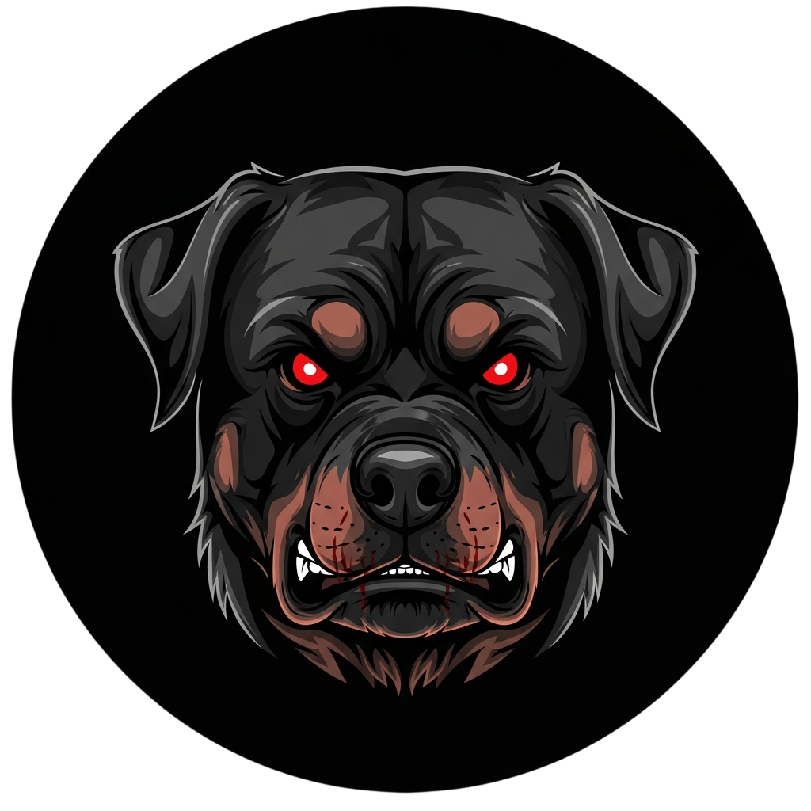

<div align="center">



# ROTTWEILER

**Dark Web Intelligence Engine**

Multi-engine Tor search with AI-powered analysis. Hunt across hidden services, extract onion links, and generate actionable intelligence.


[](https://www.python.org/)
[](https://www.docker.com/)
[](https://streamlit.io/)
[](https://www.torproject.org/)

</div>

---

## Features

- **13 Search Engines**: Ahmia, OnionLand, Torgle, Ahmesia, Torland, Find Tor, Excavator, Onionway, Tor66, OSS, Torgol, The Deep Searches, Dark Search
- **Concurrent Scraping**: Multi-threaded content retrieval via Tor SOCKS proxy
- **BM25 Ranking**: Query-relevance scoring for result ordering
- **Multi-Provider LLM**: Anthropic Claude, OpenAI GPT-4o, Google Gemini, Groq Llama 3.3, OpenRouter
- **Service Monitoring**: Track uptime and availability of discovered onion services
- **Timeline Tracking**: Chronological logging of intelligence operations
- **Dockerized**: Container-based deployment with integrated Tor daemon

---

## Architecture
```
┌─────────────────────────────────────────────┐
│           STREAMLIT INTERFACE               │
└──────────────────┬──────────────────────────┘
                   │
      ┌────────────┴────────────┐
      │                         │
 ┌────▼─────┐            ┌─────▼──────┐
 │ SCRAPER  │            │    LLM     │
 │  MODULE  │            │   MODULE   │
 └────┬─────┘            └─────┬──────┘
      │                        │
 ┌────▼────────────────────────▼───┐
 │      PIPELINE MODULE            │
 │  • Tor Proxy                    │
 │  • BM25 Ranking                 │
 │  • Caching                      │
 └────┬────────────────────────────┘
      │
 ┌────▼─────┐
 │ MONITOR  │
 └──────────┘
```

### Components

| Module | Function |
|--------|----------|
| **Scraper** | Multi-engine search, onion extraction |
| **Pipeline** | Concurrent scraping, content processing, BM25 ranking |
| **Monitor** | Uptime tracking, availability checks |
| **LLM** | Multi-provider intelligence analysis |
| **Interface** | Query input, result visualization |

---

## Installation

### Local Setup
```bash
# Clone repository
git clone https://github.com/yourusername/rottweiler.git
cd rottweiler

# Install dependencies
pip install -r requirements.txt

# Install Tor
# Ubuntu/Debian
sudo apt update && sudo apt install tor
sudo systemctl start tor

# macOS
brew install tor
brew services start tor

# Configure environment
cp .env.example .env
nano .env  # Add API keys

# Launch
streamlit run app.py
```

### Docker Setup
```bash
# Build and run
docker-compose up -d

# Access at http://localhost:8501
```

### Environment Variables
```env
# .env configuration
ANTHROPIC_API_KEY=sk-ant-xxxxx
OPENAI_API_KEY=sk-xxxxx
GOOGLE_API_KEY=xxxxx
GROQ_API_KEY=gsk_xxxxx
OPENROUTER_API_KEY=sk-or-xxxxx

TOR_PROXY_HOST=localhost
TOR_PROXY_PORT=9050
MAX_WORKERS=10
TIMEOUT_SECONDS=30
```

---

## Disclaimer

ROTTWEILER is provided for lawful security research and threat intelligence. Users are solely responsible for legal compliance. Do not use for illegal activities. No warranty provided.

---

## License

MIT License - See [LICENSE](LICENSE)

---

<div align="center">

**ROTTWEILER** - Hunt. Analyze. Protect.

</div>
