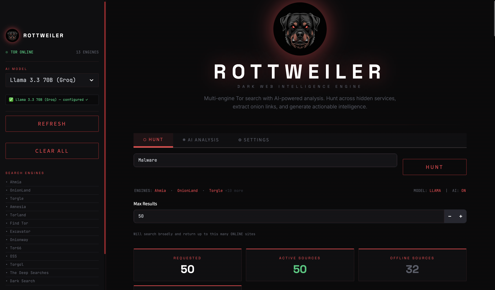
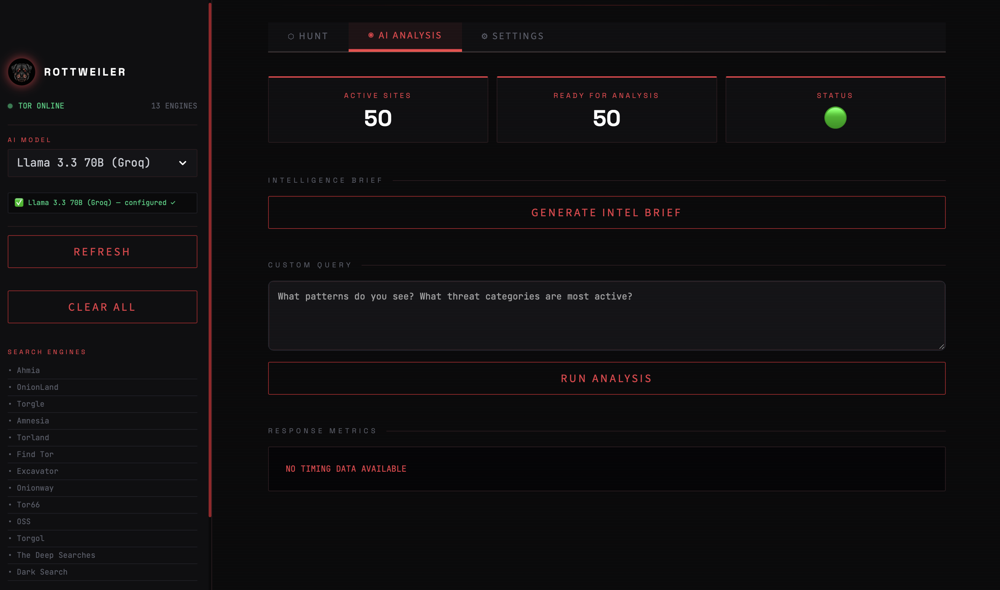
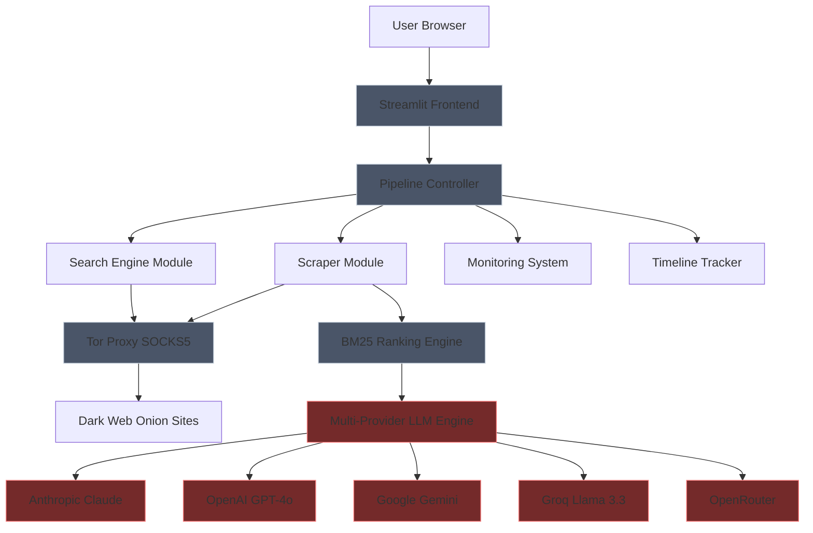

<div align="center">


# ROTTWEILER

**Dark Web Intelligence Engine**

Multi-engine Tor search with AI-powered intelligence analysis and structured report generation.

[](https://www.python.org/)
[](https://www.docker.com/)
[](https://streamlit.io/)
[](https://www.torproject.org/)
[](LICENSE)

</div>

---

## Interface

### Hunt Dashboard


### AI Analysis Page


---

## Features

### Intelligence Collection
- 13 integrated Tor search engines  
- Concurrent scraping via Tor SOCKS5 proxy  
- BM25 relevance ranking (Okapi BM25)  
- Service uptime monitoring  
- Timeline-based intelligence tracking  

### AI Analysis
- Multi-provider LLM support (Claude, GPT-4o, Gemini, Groq Llama 3.3, OpenRouter)  
- Automated intelligence brief generation  
- Export results as structured `.md` reports  

### Deployment
- Dockerized architecture with integrated Tor daemon  
- Environment-based secure configuration  
- Modular scraper, pipeline, monitor, and LLM layers  

---

## Architecture


---

## Installation

### Prerequisites

- Python 3.9+
- Tor daemon
- Docker (optional)

### Local Setup
```bash
git clone https://github.com/yourusername/rottweiler.git
cd rottweiler
pip install -r requirements.txt

# macOS
brew install tor
brew services start tor

# Ubuntu/Debian
sudo apt update && sudo apt install tor
sudo systemctl start tor

cp .env.example .env
# Add your API keys inside .env

streamlit run app.py
```

Access: `http://localhost:8501`

### Docker Setup
```bash
docker-compose up -d
docker-compose logs -f
docker-compose down
```

Access: `http://localhost:8501`

### Environment Configuration
```env
ANTHROPIC_API_KEY=
OPENAI_API_KEY=
GOOGLE_API_KEY=
GROQ_API_KEY=
OPENROUTER_API_KEY=

TOR_PROXY_HOST=localhost
TOR_PROXY_PORT=9050
MAX_WORKERS=10
TIMEOUT_SECONDS=30
```

---

## Legal Notice

ROTTWEILER is provided for lawful security research and threat intelligence. Users are responsible for compliance with applicable laws.

---

<div align="center">

**ROTTWEILER** — Hunt. Analyze. Protect.

</div>
