<div align="center">


# **ROTTWEILER**

**Dark Web Intelligence Engine**

Multi-engine Tor search with AI-powered intelligence analysis and structured report generation.

[](https://www.python.org/)
[](https://www.docker.com/)
[](https://streamlit.io/)
[](https://www.torproject.org/)
[](LICENSE)

</div>

---

## Interface

### Hunt Dashboard


*Real-time search execution with multi-engine queries, concurrent scraping, and source status tracking*

### AI Analysis Page


*LLM-powered intelligence brief generation with exportable markdown reports*

---

## Features

### Intelligence Collection
- **13 Search Engines**: Ahmia, OnionLand, Torgle, Ahmesia, Torland, Find Tor, Excavator, Onionway, Tor66, OSS, Torgol, The Deep Searches, Dark Search
- **Concurrent Scraping**: Multi-threaded content retrieval via Tor SOCKS5 proxy
- **BM25 Ranking**: Query-relevance scoring using Okapi BM25 algorithm
- **Service Monitoring**: Real-time uptime tracking of discovered onion services
- **Timeline Tracking**: Chronological logging of intelligence operations

### AI-Powered Analysis
- **Multi-Provider LLM Support**:
  - Anthropic Claude (Sonnet 4, Opus 4)
  - OpenAI GPT-4o
  - Google Gemini 2.0
  - Groq Llama 3.3 70B
  - OpenRouter
- **Intelligence Brief Generation**: Automated threat assessment and report creation
- **Export Functionality**: Download results as structured `.md` intelligence reports

### Deployment
- **Dockerized Architecture**: Container-based deployment with integrated Tor daemon
- **Secure Configuration**: Environment variable-based credential management
- **Modular Design**: Separated scraper, pipeline, monitor, and LLM components

---

## Architecture

```mermaid
graph TB
    subgraph Layer1["Layer 1: User Interface"]
        User["👤 User<br/>(Browser)"]
        Streamlit["Streamlit Frontend<br/>(app.py, ui.uy)"]
        Pipeline1["Pipeline"]
        Search1["Search"]
        Tor1["Tor"]
        Onion1["Onion Sites"]
    end

    subgraph Layer2["Layer 2: Core Application Layer"]
        PipelineCtrl["Pipeline Controller<br/>(pipeline.py)"]
        SearchEngine["Search Engine Module<br/>(tor_search.py)"]
        Scraper["Scraper Module<br/>(scraper.py)"]
        Monitor["Monitoring System<br/>(monitor.py)"]
        Timeline["Timeline Tracker<br/>(timeline.py)"]
    end

    subgraph Layer3["Layer 3: Intelligence Layer"]
        BM25["BM25 Ranking<br/>Engine"]
        LLM["Multi-Provider LLM Engine<br/>(llm_prompt.py)"]
        Claude["Anthropic<br/>(Claude)"]
        OpenAI["OpenAI<br/>(GPT-4o)"]
        Gemini["Google<br/>Gemini"]
        Groq["Groq<br/>(Llama 3.3)"]
        OpenRouter["OpenRouter"]
    end

    subgraph Layer4["Layer 4: Network Layer"]
        TorProxy["🧅 Tor Proxy<br/>(SOCKS5 127.0.0.1:9050)"]
        DarkWeb["Dark Web<br/>(.onion sites)"]
    end

    subgraph Layer5["Layer 5: Infrastructure Layer"]
        Docker["🐳 Docker Container"]
        EnvVars["Environment Variables<br/>(.env)"]
    end

    User --> Streamlit
    Streamlit --> Pipeline1
    Pipeline1 --> Search1
    Search1 --> Tor1
    Tor1 --> Onion1

    Streamlit --> PipelineCtrl
    PipelineCtrl --> SearchEngine
    PipelineCtrl --> Scraper
    PipelineCtrl --> Monitor
    PipelineCtrl --> Timeline

    Scraper --> BM25
    BM25 --> LLM
    LLM --> Claude
    LLM --> OpenAI
    LLM --> Gemini
    LLM --> Groq
    LLM --> OpenRouter

    SearchEngine --> TorProxy
    Scraper --> TorProxy
    TorProxy --> DarkWeb

    PipelineCtrl -.-> Docker
    Docker -.-> EnvVars

    style Layer1 fill:#2d3748,stroke:#4a5568,stroke-width:2px
    style Layer2 fill:#2d3748,stroke:#4a5568,stroke-width:2px
    style Layer3 fill:#2d3748,stroke:#4a5568,stroke-width:2px
    style Layer4 fill:#2d3748,stroke:#4a5568,stroke-width:2px
    style Layer5 fill:#2d3748,stroke:#4a5568,stroke-width:2px
    
    style User fill:#4a5568,stroke:#cbd5e0,stroke-width:2px
    style Streamlit fill:#4a5568,stroke:#cbd5e0,stroke-width:2px
    style PipelineCtrl fill:#4a5568,stroke:#cbd5e0,stroke-width:2px
    style BM25 fill:#4a5568,stroke:#cbd5e0,stroke-width:2px
    style LLM fill:#742a2a,stroke:#fc8181,stroke-width:2px
    style Claude fill:#742a2a,stroke:#fc8181,stroke-width:2px
    style OpenAI fill:#742a2a,stroke:#fc8181,stroke-width:2px
    style Gemini fill:#742a2a,stroke:#fc8181,stroke-width:2px
    style Groq fill:#742a2a,stroke:#fc8181,stroke-width:2px
    style OpenRouter fill:#742a2a,stroke:#fc8181,stroke-width:2px
    style TorProxy fill:#4a5568,stroke:#cbd5e0,stroke-width:2px
    style DarkWeb fill:#4a5568,stroke:#cbd5e0,stroke-width:2px
    style Docker fill:#4a5568,stroke:#cbd5e0,stroke-width:2px
```

<div align="center">


</div>

### Component Responsibilities

| Layer | Component | Function |
|-------|-----------|----------|
| **Layer 1** | User Interface | Browser-based Streamlit frontend for query input and result visualization |
| **Layer 2** | Core Application | Pipeline Controller orchestrates search and scraping operations |
| | | Search Engine Module queries 13 Tor search engines |
| | | Scraper Module performs concurrent content retrieval |
| | | Monitoring System tracks service uptime and availability |
| | | Timeline Tracker maintains chronological operation logs |
| **Layer 3** | Intelligence | BM25 Ranking Engine scores results by query relevance |
| | | Multi-Provider LLM Engine generates intelligence reports |
| **Layer 4** | Network | Tor Proxy routes all requests through SOCKS5 (127.0.0.1:9050) |
| | | Provides anonymous access to dark web .onion sites |
| **Layer 5** | Infrastructure | Docker Container encapsulates application and Tor daemon |
| | | Environment Variables manage API keys and configuration |

---

## Installation

### Prerequisites

- Python 3.9+
- Tor daemon
- Docker (optional)

### Local Installation
```bash
# Clone repository
git clone https://github.com/yourusername/rottweiler.git
cd rottweiler

# Install dependencies
pip install -r requirements.txt

# Install and start Tor
# macOS
brew install tor
brew services start tor

# Ubuntu/Debian
sudo apt update && sudo apt install tor
sudo systemctl start tor

# Configure environment variables
cp .env.example .env
nano .env  # Add your API keys

# Launch application
streamlit run app.py
```

Access at `http://localhost:8501`

### Docker Installation
```bash
# Build and start containers
docker-compose up -d

# View logs
docker-compose logs -f

# Stop containers
docker-compose down
```

Access at `http://localhost:8501`

### Environment Configuration
```env
# .env file
ANTHROPIC_API_KEY=sk-ant-xxxxx
OPENAI_API_KEY=sk-xxxxx
GOOGLE_API_KEY=xxxxx
GROQ_API_KEY=gsk_xxxxx
OPENROUTER_API_KEY=sk-or-xxxxx

TOR_PROXY_HOST=localhost
TOR_PROXY_PORT=9050
MAX_WORKERS=10
TIMEOUT_SECONDS=30
```

---

## Usage

1. Launch application (local or Docker)
2. Enter search query in Hunt dashboard
3. Select LLM provider and model
4. Configure search engines and max results
5. Click HUNT to initiate search
6. Review results: Requested / Active Sources / Offline Sources
7. Navigate to AI Analysis tab for intelligence brief
8. Export results as `.md` report

---

## Security

- All requests routed through Tor SOCKS5 proxy
- No direct connections to .onion services
- Environment variable-based credential management
- Local-only data storage
- Docker isolation for deployment

**Legal Notice**: ROTTWEILER is provided for lawful security research and threat intelligence. Users are solely responsible for legal compliance. Do not use for illegal activities.

---

## License

MIT License - See [LICENSE](LICENSE)

---

<div align="center">

**ROTTWEILER** - Hunt. Analyze. Protect.

</div>
